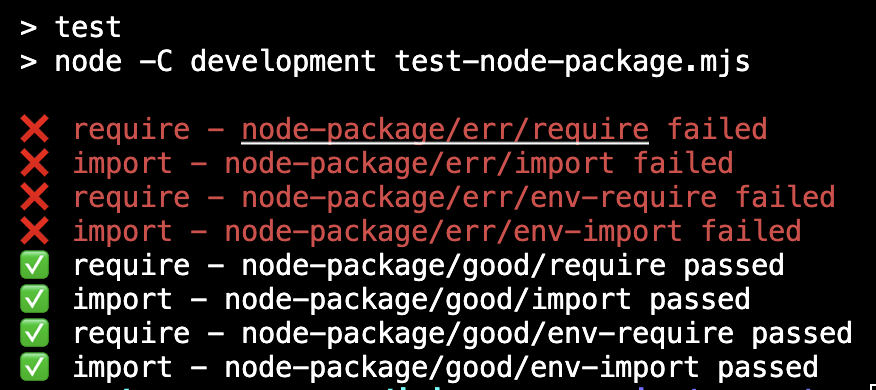

# Reproduction of package.json export error cases

This project is a reproduction of issues caused by improperly sorted conditions. At the moment, it focuses on the `node` and environment conditions (like `development`).

This is meant to demonstrate that the `node` and environment conditions must come before `import` and `require` conditions. These conditions represent a higher intent than `import` and `require` conditions, so it should be considered an error if they are not sorted accordingly (higher intent conditions at the top).

